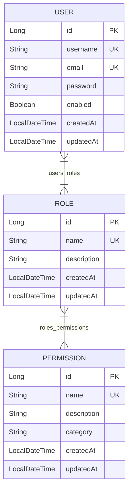
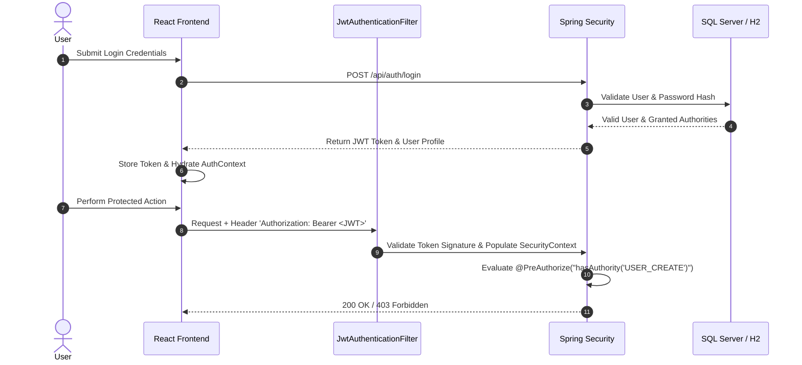

# Role  Permission Management System (RBAC)

A complete, production-grade **Role and Permission Management System** built with a stateless **Spring Boot 3 REST API** backend and a modern, dynamic **React + Tailwind CSS** frontend.

---

## 🚀 Overview

This application implements a complete **Role-Based Access Control (RBAC)** and **Permission-Based Access Control** system. Security is strictly enforced at the backend REST API level using Spring Security method-level authorization (`@PreAuthorize("hasAuthority(...)")`), while the dynamic React frontend automatically hides or renders UI actions based on authenticated user authorities.

```
User ──► Role ──► Permissions
```

---

## ✨ Features

- **Stateless JWT Authentication**: Secure user login, user self-registration, state persistence, and auto-refresh using JJWT.
- **Granular Permission Authorization**: Fine-grained authorities (`USER_READ`, `USER_CREATE`, `USER_UPDATE`, `USER_DELETE`, `ROLE_READ`, `ROLE_CREATE`, `ROLE_UPDATE`, `ROLE_DELETE`, `PERMISSION_READ`, `PERMISSION_CREATE`, `PERMISSION_UPDATE`, `PERMISSION_DELETE`).
- **User Management**: Complete CRUD operations, user search, status toggle (Active/Disabled), and role assignment.
- **Role Management**: Define custom roles and interactively assign permission matrices using responsive checkbox grids.
- **Permission Management**: Categorized permission view (`USER`, `ROLE`, `PERMISSION`, `GENERAL`) with complete CRUD support.
- **Real-Time Analytics Dashboard**: Fetches live backend statistics (Total Users, Total Roles, Total Permissions, Active Users, Role Distribution chart, Recent Registrations).
- **Security & Error Handling**: Global `@RestControllerAdvice` mapping errors to clean JSON responses (`401 Unauthorized`, `403 Forbidden`, `404 Not Found`, `409 Conflict`).
- **Database Initializer**: Automatic startup seeding of standard permissions, roles (`ROLE_ADMIN`, `ROLE_MANAGER`, `ROLE_USER`), and initial admin user.

---

## 🛠 Technology Stack

### Backend
- **Framework**: Java 17 / 22, Spring Boot 3.2.5
- **Security**: Spring Security 6, JJWT 0.12.5 (`jjwt-api`, `jjwt-impl`, `jjwt-jackson`)
- **Persistence**: Spring Data JPA, Hibernate, Bean Validation
- **Database**: Microsoft SQL Server (`mssql-jdbc`) & H2 In-Memory DB for rapid dev/test
- **Build Tool**: Apache Maven

### Frontend
- **Core**: React 18, Vite 5, JavaScript (ES6+)
- **Styling**: Tailwind CSS 3.4 with glassmorphism card panels, modern dark accent theme
- **Icons**: Lucide React (`lucide-react`)
- **Routing**: React Router DOM v6
- **HTTP Client**: Axios with request/response interceptors for Bearer JWT injection & 401 handling

---

## 📐 Architecture & Flows

### RBAC Model


### Authentication Sequence


---

## 📁 Project Structure

```text
role_management/
├── backend/
│   ├── src/
│   │   ├── main/
│   │   │   ├── java/com/rolemanagement/
│   │   │   │   ├── config/          # SecurityConfig, DataInitializer
│   │   │   │   ├── controller/      # Auth, User, Role, Permission, Dashboard Controllers
│   │   │   │   ├── dto/             # LoginRequest, UserDto, RoleDto, PagedResponse, etc.
│   │   │   │   ├── entity/          # User, Role, Permission JPA Entities
│   │   │   │   ├── exception/       # ResourceNotFoundException, GlobalExceptionHandler
│   │   │   │   ├── repository/     # UserRepository, RoleRepository, PermissionRepository
│   │   │   │   ├── security/       # JwtTokenProvider, JwtAuthenticationFilter, CustomUserDetailsService
│   │   │   │   └── service/        # AuthService, UserService, RoleService, PermissionService, DashboardService
│   │   │   └── resources/
│   │   │       ├── application.yml         # Dev profile (H2 in-memory)
│   │   │       └── application-prod.yml    # Prod profile (Microsoft SQL Server)
│   │   └── test/                    # Backend JUnit 5 & Spring Security Integration Tests
│   └── pom.xml
│
├── frontend/
│   ├── src/
│   │   ├── api/          # Axios instance & Auth/User/Role/Permission API modules
│   │   ├── components/   # Navbar, Sidebar, ProtectedRoute, PermissionGuard, Modal, Toast
│   │   ├── context/      # AuthContext provider & hooks
│   │   ├── layouts/      # MainLayout
│   │   ├── pages/        # Login, Register, Dashboard, Users, UserDetail, Roles, RoleDetail, Permissions, PermissionDetail, Profile
│   │   ├── App.jsx       # Router configuration
│   │   ├── index.css     # Tailwind CSS directives & glassmorphism utilities
│   │   └── main.jsx
│   ├── package.json
│   ├── tailwind.config.js
│   └── vite.config.js
│
├── README.md
└── .gitignore
```

---

## ⚡ Quick Start & Setup

### Prerequisites
- **Java**: 17 or higher
- **Node.js**: v18 or higher
- **Maven**: 3.8+

---

### 1. Backend Setup

Navigate to the `backend` directory:
```bash
cd backend
```

#### Run Unit & Integration Tests:
```bash
mvn clean test
```

#### Run Backend Server (Development Profile - H2 DB):
```bash
mvn spring-boot:run
```
The REST API will be available at: `http://localhost:8080`  
H2 Console available at: `http://localhost:8080/h2-console` (JDBC URL: `jdbc:h2:mem:role_management_db`)

#### Run with Microsoft SQL Server (Production Profile):
Set environment variables:
```bash
export DB_URL=jdbc:sqlserver://localhost:1433;databaseName=role_management_db;encrypt=true;trustServerCertificate=true
export DB_USERNAME=sa
export DB_PASSWORD=YourStrong@Passw0rd
export JWT_SECRET=9a4f2c8d7e1b5a3f6c8d9e0b2a4f6c8d9e0b2a4f6c8d9e0b2a4f6c8d9e0b2a4f
```
Execute:
```bash
mvn spring-boot:run -Dspring-boot.run.profiles=prod
```

---

### 2. Frontend Setup

Navigate to the `frontend` directory:
```bash
cd frontend
```

#### Install Dependencies:
```bash
npm install
```

#### Run Development Server:
```bash
npm run dev
```
The React frontend will start at: `http://localhost:5173`

#### Build for Production:
```bash
npm run build
```

---

## 🔑 Default Credentials

On startup, `DataInitializer` seeds default credentials:

| Username | Password | Default Role | Description |
| :--- | :--- | :--- | :--- |
| `admin` | `adminpassword` | `ROLE_ADMIN` | Full administrator access with all permissions |
| `manager` | `managerpassword` | `ROLE_MANAGER` | User management & read-only access |
| `user` | `userpassword` | `ROLE_USER` | Standard user with read-only access |

---

## 📡 API Reference Endpoint List

### Authentication APIs
- `POST /api/auth/login` - Authenticate user & issue JWT
- `POST /api/auth/register` - User self-registration
- `GET /api/auth/me` - Get current authenticated user profile

### User Management APIs (`@PreAuthorize("hasAuthority('USER_...')")`)
- `GET /api/users` - Paginated user list with search filter
- `GET /api/users/{id}` - Fetch user by ID
- `POST /api/users` - Create user
- `PUT /api/users/{id}` - Update user
- `DELETE /api/users/{id}` - Delete user
- `POST /api/users/{id}/roles` - Assign roles to user
- `DELETE /api/users/{id}/roles/{roleId}` - Remove role from user
- `PATCH /api/users/{id}/toggle-status` - Enable/Disable user account

### Role Management APIs (`@PreAuthorize("hasAuthority('ROLE_...')")`)
- `GET /api/roles` - Paginated roles list with search
- `GET /api/roles/{id}` - Fetch role details
- `POST /api/roles` - Create role
- `PUT /api/roles/{id}` - Update role
- `DELETE /api/roles/{id}` - Delete role
- `POST /api/roles/{id}/permissions` - Assign permissions to role
- `DELETE /api/roles/{id}/permissions/{permissionId}` - Remove permission from role

### Permission Management APIs (`@PreAuthorize("hasAuthority('PERMISSION_...')")`)
- `GET /api/permissions` - List permissions
- `GET /api/permissions/{id}` - Fetch permission by ID
- `POST /api/permissions` - Create permission
- `PUT /api/permissions/{id}` - Update permission
- `DELETE /api/permissions/{id}` - Delete permission

### Dashboard API
- `GET /api/dashboard/stats` - Fetch real-time system metrics

---

## 🧪 Acceptance Test Flow

1. Open `http://localhost:5173/login`.
2. Click **Admin** quick fill or enter `admin` / `adminpassword`.
3. Verify live dashboard metrics fetched from the backend API.
4. Navigate to **User Management** -> Click **Add New User** -> Create user `testmanager`.
5. Navigate to **Role Management** -> Click **Create New Role** -> Create `ROLE_SUPPORT`.
6. Assign permissions (`USER_READ`, `ROLE_READ`) to `ROLE_SUPPORT`.
7. Assign `ROLE_SUPPORT` to `testmanager`.
8. Log out and sign in as `testmanager`.
9. Verify that navigation tabs and action buttons dynamically reflect `testmanager` authorities (e.g. Delete button hidden).
10. Verify direct unauthorized REST API requests return `403 Forbidden`.
